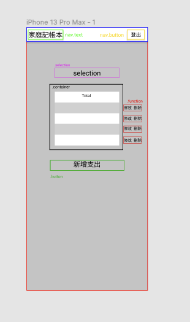
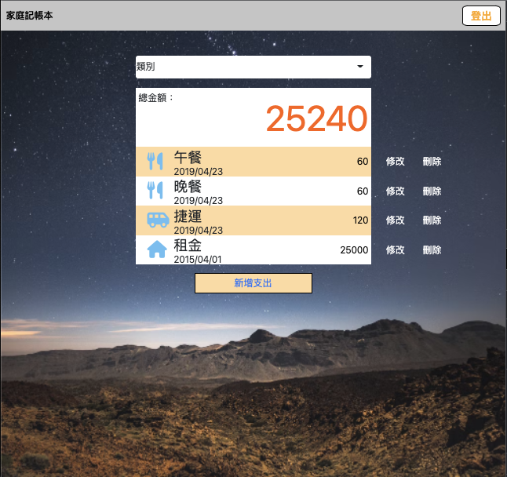
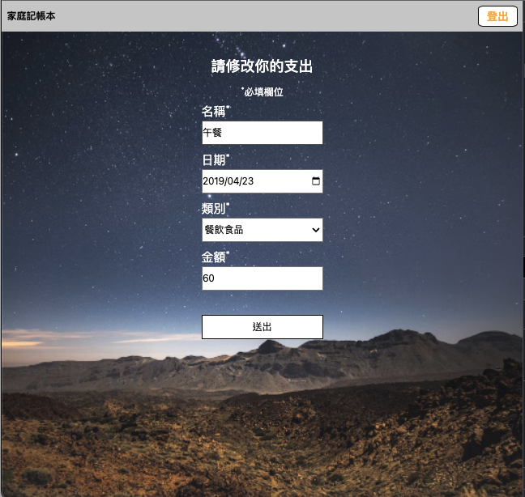

# expense-tracker
用於記帳的網站，提供使用者紀錄自身支出


### Function list
- 使用者可以用email建立帳號
- 使用者可以用email重設密碼
- 使用者必需要以收到的驗證碼進行驗證
- 使用者可以瀏覽自己所有的支出
- 使用者可以新增自己的支出
- 使用者可以修改自己的支出
- 使用者可以刪除自己的支出


### Installing

需要下列環境
```
node.js

npm 套件 :
  "bcryptjs": "^2.4.3",
  "connect-flash": "^0.1.1",
  "dotenv": "^8.2.0",
  "express": "^4.17.3",
  "express-handlebars": "^6.0.3",,
  "express-session": "^1.17.1",
  "method-override": "^3.0.0",
  "mongoose": "^6.2.6",
  "node-sass-middleware": "^1.0.1",
  "passport": "^0.4.1",
  "passport-local": "^1.0.0",
  "nodemailer": "^6.7.3"

資料庫 :
  MongoDB
```
開啟終端機(Terminal)，cd到存放專案本機位置並執行
```
git clone https://github.com/eruc1117/expense-tracker.git
```
下載專案後再次cd到expense-tracker，再往下進行<br>

安裝套件 
```
npm install
```
製作種子資料
```
npm run seed
```

運行主程式
```
npm run dev
```
將terminal顯示的localhost:3000貼到網頁上執行

## data format
user:
- id
- name
- email
- password

category:
- id
- name

record:
- id
- name
- date
- amount
- categoryId
- userId

## wireframe

#首頁


#登入及註冊


#總清單



#建立或修改支出


## Running the tests


顯示全部的支出



顯示修改頁面

## 關於忘記密碼驗證方式
routes/modules/user.js中*****分別填入Google帳號密碼，
需要在Google減弱帳號安全性，或是增加app password。
